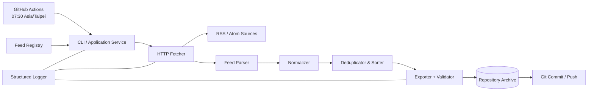
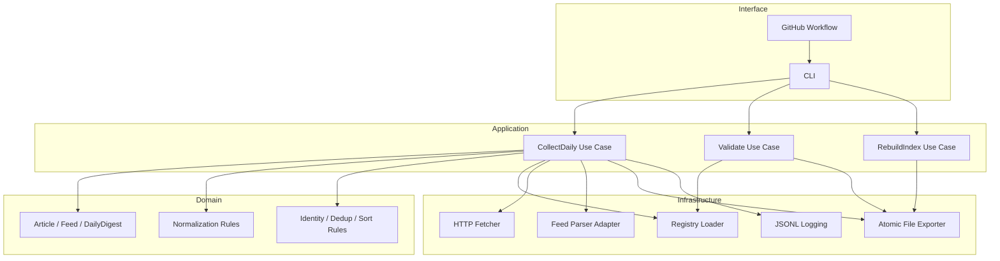
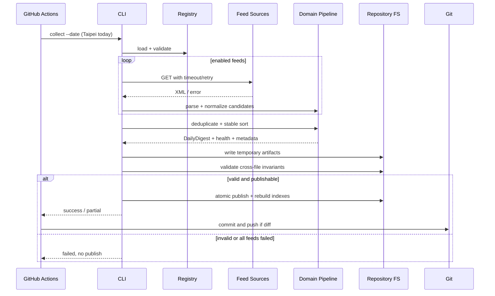
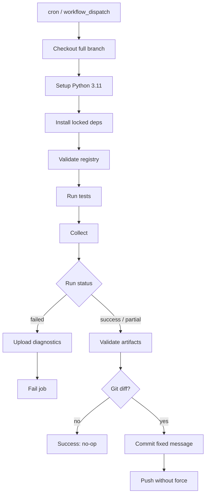
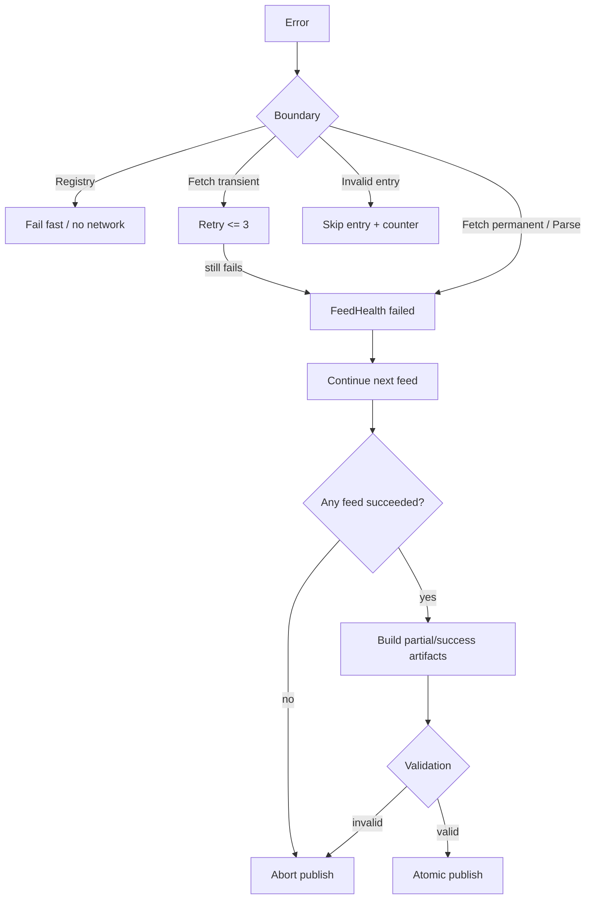

# Architecture

> 文件版本：1.0.0  
> 架構原則：Collect → Normalize → Export；無 database、無 UI、無 AI。

## 1. System Architecture

系統採單一批次程序與 Clean Architecture 邊界。GitHub Actions 是 scheduler/deployment environment，Python CLI 是 application entrypoint，repository filesystem 是唯一持久化介面。Domain model 不知道 GitHub Actions、HTTP client 或 JSON 檔案的存在。



系統只有一條 write path。Fetcher 與 Parser 可針對各 Feed 並行，但合併、排序與輸出必須在單一 deterministic pipeline 進行。

## 2. Component Diagram



## 3. Data Flow

1. Resolve collection date in `Asia/Taipei`.
2. Load and validate Feed registry; freeze enabled Feed list.
3. Fetch each Feed with bounded timeout, response size and retry.
4. Parse XML into parser-neutral entry records.
5. Select entries whose effective time falls within the Taipei date window.
6. Normalize text, URL, timestamps, authors and categories.
7. Generate deterministic Article IDs.
8. Deduplicate and merge provenance using stable rules.
9. Sort Articles and FeedHealth.
10. Construct DailyDigest、Metadata 與 derived Markdown。
11. Write all candidates to a temporary directory.
12. Validate required files and cross-file invariants.
13. Atomic publish daily directory, then rebuild index/archive/latest.
14. Workflow detects Git diff and commits only valid changes.

### Deterministic merge policy

同 ID 多筆候選資料先依 `(feed_id, normalized payload JSON)` 升冪排列，再：

- `source_feed_ids`：聯集後升冪排序。
- scalar 欄位：選第一個 non-empty value。
- list 欄位：正規化、去重、升冪排序。
- `published_at`：選最早有效 published time；`updated_at` 選最晚有效 updated time。
- 任何衝突記錄 warning，但不得依 thread completion order 決定。

## 4. Sequence Diagram



## 5. Directory Structure

以下是 implementation target；建立程式碼前應先由 Sprint 1 確認：

```text
.
├── .github/
│   └── workflows/
│       └── daily-collect.yml
├── config/
│   └── feeds.json
├── data/
│   ├── latest.json
│   ├── index.json
│   ├── archive.json
│   └── YYYY/MM/DD/
│       ├── README.md
│       ├── articles.json
│       ├── metadata.json
│       └── feed_health.json
├── docs/
│   ├── README.md
│   ├── PRODUCT_REQUIREMENTS.md
│   ├── ARCHITECTURE.md
│   ├── JSON_SCHEMA.md
│   ├── TODO.md
│   ├── DECISIONS.md
│   └── CONTRIBUTING.md
├── src/
│   └── rss_daily_collector/
│       ├── __init__.py
│       ├── cli.py
│       ├── models.py
│       ├── collect.py
│       ├── registry.py
│       ├── fetch.py
│       ├── parse.py
│       ├── normalize.py
│       ├── export.py
│       └── logging_config.py
├── tests/
│   ├── fixtures/
│   ├── test_normalize.py
│   ├── test_collect.py
│   └── test_export.py
├── pyproject.toml
├── LICENSE
└── README.md
```

不建立 `services/`、`repositories/`、interface class 或 plugin tree，直到第二個實作或明確替換需求出現。

## 6. Module Responsibility

| Module | 唯一責任 | 不得負責 |
|---|---|---|
| `cli.py` | 參數解析、exit code、use case dispatch | domain 規則 |
| `models.py` | frozen dataclass 與 enum | I/O、parser-specific object |
| `collect.py` | orchestration 與 run status | HTTP/XML 細節 |
| `registry.py` | 載入及驗證 `feeds.json` | 抓取 Feed |
| `fetch.py` | bounded HTTP GET、retry、response metadata | XML 解析 |
| `parse.py` | parser adapter → neutral records | 日期篩選、輸出 |
| `normalize.py` | 時間、文字、URL、ID、dedup、sort | network、filesystem |
| `export.py` | projection、Schema/cross-file validation、atomic publish、indexes | 抓取或 AI |
| `logging_config.py` | JSONL event formatting 與 redaction | business decisions |

## 7. Dependency Rules

依賴方向：

```text
Interface → Application → Domain
Infrastructure → Domain contracts/data
Domain → Python standard library only
```

- `models.py` 與純 normalization functions 不 import infrastructure。
- `collect.py` 可呼叫具體的簡單 functions；沒有第二個 adapter 前不建立抽象 class。
- `parse.py` 是唯一可接觸 Feed parser dependency 的模組。
- `export.py` 是唯一可寫入 `data/` 的模組。
- Git operation 留在 workflow，不放進 Python domain/application。
- 模組不得讀取 GitHub-specific environment variable，CLI entrypoint 可將必要值轉成一般參數。
- 不允許 circular import。

## 8. Extension Points

只保留低成本、需求導向的 seams：

- **Feed format**：在 `parse.py` 增加 parser mapping，輸出相同 neutral record。
- **Normalization rule**：純函式與 fixture-driven test。
- **Exporter**：當有真實新 consumer 時新增 projection function；DailyDigest 不變。
- **Storage**：只有 Git repository 量測超限時，才以新的 application boundary 替換 atomic exporter。
- **Schedule**：workflow cron 可變，domain 的 collection date/window 不綁定 cron。

禁止把 AI processor 放入本 repository。AI 是下游 consumer。

## 9. Deployment

Production deployment 是 repository default branch 上的 GitHub Actions workflow，不存在 server：

- 依賴固定於 `pyproject.toml`/lock strategy。
- GitHub-hosted Ubuntu runner 每次從乾淨環境執行。
- archive 與程式碼一起 version controlled。
- workflow 只在 validated output 後 commit。
- branch protection 與 PR review 保護程式碼/規格；bot 對 daily data commit 的權限應最小化。
- 本機執行只供開發、validate 與 backfill，不是另一個 production state。

## 10. GitHub Actions Flow



Workflow 的 `schedule` 是 UTC `30 23 * * *`。程式在執行時重新計算 Asia/Taipei date，以抵抗排程延遲與 UTC 跨日。

## 11. Error Flow



Exit codes：

| Code | 意義 |
|---:|---|
| 0 | success，或 dry-run 成功 |
| 2 | partial success；artifacts 已有效發布 |
| 10 | configuration/argument error |
| 20 | collection failed（所有來源失敗） |
| 30 | export/validation failed |
| 40 | unexpected internal error |

GitHub workflow 可將 exit code 2 視為可 commit 的 warning outcome；其他非零不得 commit。

## 12. Cross-file Invariants

- `DailyDigest.collection_date == Metadata.collection_date == daily path date`。
- `DailyDigest.article_count == len(articles)`。
- Metadata 的 feed counts 與 FeedHealth status counts 相等。
- Markdown 的 article IDs/order 與 DailyDigest 完全一致。
- Index/Archive 中每個日期路徑都存在且通過 validation。
- Latest 指向 index 中最大 collection date，而非最後一次執行日期。
- `schema_version` major 必須由 reader 顯式支援。
- Article ID、排序與 daily content 不受 `run_id` 或 wall-clock duration 影響。
