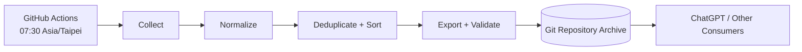

# RSS Daily Collector Documentation

這個 `docs/` 目錄是 RSS Daily Collector 的產品與工程 Single Source of Truth。系統定位是 Knowledge Pipeline 的 Collection Layer，只做：

目標 GitHub Repository：<https://github.com/50ph1el1n/rss-daily>

```text
Collect → Normalize → Export
```

不做 AI、摘要、推薦、Embedding、Vector Database、Knowledge Graph、Obsidian 或 Web UI。

## Project Overview

每天台北時間 07:30，GitHub Actions 讀取版本控制的 RSS/Atom Feed registry，選出 Asia/Taipei 當日文章，正規化與去重後輸出：

- `README.md`：人類與 ChatGPT 可讀的每日內容。
- `articles.json`：canonical DailyDigest。
- `metadata.json`：run status、counts 與 provenance。
- `feed_health.json`：逐 Feed 健康與錯誤資訊。
- `data/latest.json`、`data/index.json`、`data/archive.json`：discovery indexes。

## Documentation Map

| 文件 | 回答的問題 | 規範優先權 |
|---|---|---|
| [PRODUCT_REQUIREMENTS.md](PRODUCT_REQUIREMENTS.md) | 為何做、做什麼、何時算完成 | 產品行為與 acceptance |
| [ARCHITECTURE.md](ARCHITECTURE.md) | 系統如何切分、資料如何流動 | 技術結構與 dependency |
| [JSON_SCHEMA.md](JSON_SCHEMA.md) | JSON 欄位、validation、compatibility | 資料契約最高優先 |
| [DECISIONS.md](DECISIONS.md) | 為何選擇此架構 | 不可逆/重要 trade-off |
| [TODO.md](TODO.md) | 開發順序與 Sprint DoD | Delivery backlog |
| [CONTRIBUTING.md](CONTRIBUTING.md) | 如何修改與審查 | 工程流程 |

若文件衝突：

1. JSON 欄位/型別以 `JSON_SCHEMA.md` 為準。
2. 產品 scope/acceptance 以 `PRODUCT_REQUIREMENTS.md` 為準。
3. 已 Accepted 的架構選擇以 `DECISIONS.md` 為準。
4. module/dependency 細節以 `ARCHITECTURE.md` 為準。
5. 發現衝突時必須在同一 PR 修正，不以實作現況默認覆蓋文件。

## Architecture



核心設計：

- Python 3.11 單一 batch application。
- Domain 與 HTTP/filesystem/GitHub 邊界分離。
- JSON 為 canonical；Markdown 是 deterministic projection。
- 無 database、無 server、無 message queue。
- 單 Feed failure 可 partial publish；全部失敗或 export invalid 不發布。
- daily artifacts atomic publish；Git commit 由 workflow 負責。

## Features

- RSS 2.0、RSS 1.0/RDF、Atom 1.0。
- 多 Feed registry、enabled/disabled 管理。
- Asia/Taipei 日期選取與 UTC timestamp output。
- deterministic Article ID、去重、合併與排序。
- Markdown + JSON + Metadata + FeedHealth + indexes。
- structured JSONL logging 與 GitHub Job Summary。
- manual backfill、dry-run、explicit overwrite。
- Schema SemVer 與 backward compatibility policy。

## Target Directory

```text
config/feeds.json                 # Feed registry
src/rss_daily_collector/          # Collector implementation
tests/                            # Fixtures and tests
data/YYYY/MM/DD/                  # Immutable daily archive
data/latest.json                  # Latest valid date pointer
data/index.json                   # Flat day index
data/archive.json                 # Year/month archive
.github/workflows/                # Daily schedule
docs/                             # Product/engineering SSOT
```

完整 target tree 見 `ARCHITECTURE.md`。

## How It Works

1. Workflow 以 cron `30 23 * * *` UTC 啟動。
2. Collector 使用 `Asia/Taipei` 計算 collection date，而非直接採 UTC date。
3. Registry validation 成功後逐一抓取 enabled Feeds。
4. Parser 將不同 dialect 轉成 neutral entry records。
5. Normalizer 清理文字、URL、timestamps，選出當日 entries。
6. 系統建立 stable IDs、跨 Feed 去重、deterministic merge/sort。
7. Exporter 在 temporary directory 產生並交叉驗證 artifacts。
8. 至少一個 Feed 成功時 atomic publish；全部失敗則不變更 archive。
9. 由有效 daily archive rebuild Latest/Index/Archive。
10. Workflow 有 diff 才 commit `data: collect YYYY-MM-DD` 並 push。

## Deployment and GitHub Actions

Production 不需要伺服器。default branch 上的 workflow 即 deployment：

- runner：`ubuntu-latest`
- Python：3.11
- schedule：每日台北 07:30（UTC cron `30 23 * * *`）
- concurrency：單一 collector group，不取消進行中 run
- permission：最小 `contents: write`
- timeout：20 分鐘
- failure：不 commit，保留短期 diagnostics
- push：不 force push；衝突時明確失敗

GitHub schedule 可能延遲，因此「07:30」是排程目標，不是即時 SLA。手動補跑使用 workflow_dispatch date input。

## Development Model

目前階段是 Documentation First，尚未授權/開始 implementation。開發應依：

1. Sprint 1：模型、契約、parser/normalization foundation。
2. Sprint 2：本機 end-to-end MVP 與 atomic exports。
3. Sprint 3：GitHub Actions productionization。
4. Sprint 4：hardening、14 日 observation、v1.0 release。

任何功能先對應 FR/AC；沒有需求就不預建。

## Roadmap

v1 後只在量測或真實 consumer 需求成立時評估：

- Conditional GET 與 Feed health trend。
- 每日多次收集。
- 新 export projection。
- archive 超過 Git 實務容量後的外部 storage。

## Future Plan

本 repository 始終只負責 Collection Layer。ChatGPT 或其他下游可讀取 `data/latest.json` 找到 DailyDigest，再執行摘要、推薦或知識整理；這些結果不得回寫成 Collector 的 canonical Article 欄位。

## Current Status

文件規格版本 `1.0.0` 已定義；implementation 尚未開始。實際交付進度以 `TODO.md` checkbox 與 GitHub Pull Requests 為準。
